# FIDO2 Protocol - A Junior Developer's Guide

## Table of Contents
1. [What is FIDO2?](#what-is-fido2)
2. [The Problem FIDO2 Solves](#the-problem-fido2-solves)
3. [How FIDO2 Works](#how-fido2-works)
4. [FIDO2 Components](#fido2-components)
5. [Registration Flow](#registration-flow)
6. [Authentication Flow](#authentication-flow)
7. [Code Examples](#code-examples)
8. [Use Cases](#use-cases)
9. [History of FIDO](#history-of-fido)
10. [FIDO2 vs Alternatives](#fido2-vs-alternatives)
11. [Security Benefits](#security-benefits)
12. [Implementation Guide](#implementation-guide)
13. [Common Questions](#common-questions)
14. [Resources](#resources)

---

## What is FIDO2?

**FIDO2** stands for **Fast IDentity Online 2**. It's a set of open authentication standards that lets you log in to websites and apps **without passwords**.

### The Simple Answer

**FIDO2** = A way to log in using your fingerprint, face, or a physical security key instead of typing a password.

**Think of it this way:**
```
Old way (Passwords):
  You → Type "MyP@ssw0rd123!" → Server checks if correct

New way (FIDO2):
  You → Touch fingerprint sensor or insert YubiKey → Server verifies it's really you

No password to remember, steal, or leak!
```

### What Makes FIDO2 Special?

1. **Passwordless** - No passwords to remember or type
2. **Phishing-resistant** - Can't be tricked by fake websites
3. **Privacy-preserving** - Your biometric data never leaves your device
4. **Multi-device** - Works on phones, laptops, security keys
5. **Open standard** - Not controlled by any single company

---

## The Problem FIDO2 Solves

### Passwords Are Broken

**The Harsh Reality:**
```
81% of data breaches involve stolen passwords
Average person has 100+ online accounts
Average person uses only 5-10 passwords (reused everywhere!)
Phishing attacks steal millions of passwords daily
```

**Common Password Problems:**


**Real-World Example:**

```
Scenario: LinkedIn gets hacked (2012, real event)

1. Hackers steal 6.5 million password hashes
2. User "alice@example.com" used password "Summer2012!"
3. Alice uses same password on Gmail, Facebook, Twitter
4. Hackers crack Alice's password
5. Hackers now have access to ALL Alice's accounts

Result: One breach = everything compromised
```

### FIDO2 Solution


**Why FIDO2 is Better:**
- ✅ Nothing to steal from database (public keys are useless alone)
- ✅ Can't phish (fake sites won't have your private key)
- ✅ No passwords to remember
- ✅ Works across all your devices
- ✅ Your biometric data never leaves your phone/laptop

---

## How FIDO2 Works

### The Magic: Public Key Cryptography

**Think of it like a lockbox:**

```
Public Key (stored on server):
  → Anyone can use this to lock (encrypt) things
  → Can verify signatures made with private key
  → Like a padlock you give to others

Private Key (stored on your device):
  → Only you can unlock (decrypt) things
  → Can create signatures that public key verifies
  → Like the key to the padlock, stays in your pocket
  → Protected by your fingerprint/face/PIN
```

**FIDO2 Authentication in Simple Terms:**


### Real-World Analogy

**Think of it like hotel key cards:**

```
Registration:
  1. You check into hotel
  2. Front desk programs a new key card for you
  3. Your room's lock is programmed to accept your card
  4. Key card = private key (you keep it)
  5. Lock configuration = public key (hotel keeps it)

Authentication:
  1. You return to your room
  2. You tap your key card on the lock
  3. Lock verifies it's your card
  4. Door opens

Why this is secure:
  - Your card only works for your room (domain binding)
  - Lost cards can be deactivated (revocation)
  - Can't duplicate cards easily (cryptography)
  - Even if someone steals hotel's database, they don't have your card
```

---

## FIDO2 Components

FIDO2 consists of two main standards:

### 1. WebAuthn (Web Authentication API)

**What:** Browser API that websites use to talk to authenticators

**Where:** JavaScript running in your browser

**Example:**
```javascript
// Website asks browser to create credential
const credential = await navigator.credentials.create({
  publicKey: {
    challenge: new Uint8Array([/* random bytes */]),
    rp: { name: "Example Corp" },
    user: {
      id: new Uint8Array([/* user ID */]),
      name: "alice@example.com",
      displayName: "Alice Smith"
    },
    pubKeyCredParams: [{ type: "public-key", alg: -7 }]
  }
});
```

**Browser Support:**
- ✅ Chrome 67+ (2018)
- ✅ Firefox 60+ (2018)
- ✅ Safari 14+ (2020)
- ✅ Edge 18+ (2018)

### 2. CTAP (Client to Authenticator Protocol)

**What:** Protocol for communication between browser/OS and authenticator

**Types:**
- **CTAP1 (U2F):** Original protocol, works with older security keys
- **CTAP2:** New protocol with more features (passwordless, resident keys)

**Authenticator Types:**


**Platform Authenticator (Built-in):**
```
Examples:
  - Face ID on iPhone
  - Touch ID on MacBook
  - Windows Hello on PC
  - Android fingerprint scanner

Pros:
  ✅ Always with you
  ✅ Convenient (built into device)
  ✅ Free

Cons:
  ❌ Tied to specific device
  ❌ Can't easily share across devices
```

**Roaming Authenticator (External):**
```
Examples:
  - YubiKey (USB/NFC)
  - Google Titan Key
  - Feitian ePass FIDO

Pros:
  ✅ Works on any device
  ✅ Can carry it separately
  ✅ Very secure (isolated hardware)

Cons:
  ❌ Cost money ($25-$50)
  ❌ Can lose or forget it
```

---

## Registration Flow

**Scenario:** Alice wants to register fingerprint login on example.com

### Step-by-Step Breakdown



```mermaid
sequenceDiagram
    participant Alice as 👤 Alice
    participant Browser as 🌐 Browser
    participant Authenticator as 📱 Device<br/>(iPhone)
    participant Server as 🖥️ example.com

    Note over Alice,Server: Step 1: Initiate Registration
    Alice->>Browser: Clicks "Set up fingerprint login"
    Browser->>Server: POST /register/begin<br/>{ username: "alice@example.com" }

    Note over Server: Step 2: Server Creates Challenge
    Server->>Server: Generate random challenge<br/>challenge = random_bytes(32)
    Server->>Server: Create registration options
    Server->>Browser: Return options<br/>{ challenge, rp, user, pubKeyCredParams }

    Note over Alice,Server: Step 3: Browser Calls WebAuthn API
    Browser->>Browser: navigator.credentials.create(options)
    Browser->>Authenticator: Create credential request

    Note over Alice,Server: Step 4: User Verification
    Authenticator->>Alice: "Touch sensor to register"<br/>*Shows dialog*
    Alice->>Authenticator: *Places finger on Touch ID*
    Authenticator->>Authenticator: Verify fingerprint matches

    Note over Alice,Server: Step 5: Generate Key Pair
    Authenticator->>Authenticator: Generate new key pair<br/>private_key (stays on device)<br/>public_key (sent to server)
    Authenticator->>Authenticator: Sign challenge with private_key<br/>signature = sign(challenge, private_key)

    Note over Alice,Server: Step 6: Return Credential
    Authenticator->>Browser: Credential created<br/>{ public_key, signature, attestation }
    Browser->>Server: POST /register/complete<br/>{ public_key, signature, ... }

    Note over Alice,Server: Step 7: Server Verification
    Server->>Server: Verify signature is correct
    Server->>Server: Verify challenge matches
    Server->>Server: Store public_key for alice@example.com
    Server->>Browser: ✅ Registration successful!
    Browser->>Alice: "Fingerprint registered!"
```

### Code Example: Registration

**Frontend (JavaScript):**

```javascript
// Step 1: Request registration options from server
async function registerFingerprint() {
  // Get options from server
  const optionsResponse = await fetch('/register/begin', {
    method: 'POST',
    headers: { 'Content-Type': 'application/json' },
    body: JSON.stringify({ username: 'alice@example.com' })
  });

  const options = await optionsResponse.json();

  // Convert base64 strings to ArrayBuffers (required by WebAuthn)
  options.challenge = base64ToArrayBuffer(options.challenge);
  options.user.id = base64ToArrayBuffer(options.user.id);

  // Step 2: Call WebAuthn API to create credential
  try {
    const credential = await navigator.credentials.create({
      publicKey: options
    });

    // Step 3: Send public key to server
    const registrationResponse = await fetch('/register/complete', {
      method: 'POST',
      headers: { 'Content-Type': 'application/json' },
      body: JSON.stringify({
        id: credential.id,
        rawId: arrayBufferToBase64(credential.rawId),
        response: {
          attestationObject: arrayBufferToBase64(credential.response.attestationObject),
          clientDataJSON: arrayBufferToBase64(credential.response.clientDataJSON)
        },
        type: credential.type
      })
    });

    if (registrationResponse.ok) {
      alert('✅ Fingerprint registered successfully!');
    }
  } catch (error) {
    console.error('Registration failed:', error);
    alert('❌ Registration failed: ' + error.message);
  }
}

// Helper functions
function base64ToArrayBuffer(base64) {
  const binaryString = atob(base64);
  const bytes = new Uint8Array(binaryString.length);
  for (let i = 0; i < binaryString.length; i++) {
    bytes[i] = binaryString.charCodeAt(i);
  }
  return bytes.buffer;
}

function arrayBufferToBase64(buffer) {
  const bytes = new Uint8Array(buffer);
  let binary = '';
  for (let i = 0; i < bytes.length; i++) {
    binary += String.fromCharCode(bytes[i]);
  }
  return btoa(binary);
}
```

**Backend (Node.js with @simplewebauthn/server):**

```javascript
const { generateRegistrationOptions, verifyRegistrationResponse } = require('@simplewebauthn/server');

// In-memory storage (use database in production!)
const users = new Map();

// Step 1: Generate registration options
app.post('/register/begin', async (req, res) => {
  const { username } = req.body;

  // Check if user exists
  let user = users.get(username);
  if (!user) {
    user = {
      id: crypto.randomBytes(32), // Random user ID
      username: username,
      credentials: []
    };
    users.set(username, user);
  }

  // Generate registration options
  const options = await generateRegistrationOptions({
    rpName: 'Example Corp',
    rpID: 'example.com',
    userID: user.id,
    userName: username,
    userDisplayName: username,
    attestationType: 'none',
    authenticatorSelection: {
      authenticatorAttachment: 'platform', // Use built-in biometrics
      userVerification: 'required',
      requireResidentKey: false
    },
    supportedAlgorithmIDs: [-7, -257] // ES256, RS256
  });

  // Save challenge for verification
  req.session.currentChallenge = options.challenge;

  res.json(options);
});

// Step 2: Verify registration
app.post('/register/complete', async (req, res) => {
  const { username } = req.session;
  const user = users.get(username);

  try {
    const verification = await verifyRegistrationResponse({
      response: req.body,
      expectedChallenge: req.session.currentChallenge,
      expectedOrigin: 'https://example.com',
      expectedRPID: 'example.com'
    });

    if (verification.verified) {
      // Save credential
      user.credentials.push({
        credentialID: verification.registrationInfo.credentialID,
        publicKey: verification.registrationInfo.credentialPublicKey,
        counter: verification.registrationInfo.counter
      });

      res.json({ verified: true });
    } else {
      res.status(400).json({ error: 'Verification failed' });
    }
  } catch (error) {
    console.error(error);
    res.status(400).json({ error: error.message });
  }
});
```

**What Happens Behind the Scenes:**

```
User clicks "Register fingerprint"
  ↓
Browser requests challenge from server
  ↓
Server generates random challenge: "a7f3d9c2..."
  ↓
Browser calls navigator.credentials.create()
  ↓
Operating system shows dialog: "Touch ID to register with example.com"
  ↓
User touches fingerprint sensor
  ↓
Secure Enclave (hardware) verifies fingerprint matches
  ↓
Secure Enclave generates new key pair:
  - Private key: stays in Secure Enclave (never leaves device!)
  - Public key: sent to browser
  ↓
Browser sends public key to server
  ↓
Server stores: { username: "alice@example.com", publicKey: "..." }
  ↓
Done! Alice can now log in with fingerprint
```

---

## Authentication Flow

**Scenario:** Alice wants to log in to example.com using her fingerprint

### Step-by-Step Breakdown



```mermaid
sequenceDiagram
    participant Alice as 👤 Alice
    participant Browser as 🌐 Browser
    participant Authenticator as 📱 Device<br/>(iPhone)
    participant Server as 🖥️ example.com

    Note over Alice,Server: Step 1: Initiate Login
    Alice->>Browser: Clicks "Sign in with fingerprint"
    Browser->>Server: POST /login/begin<br/>{ username: "alice@example.com" }

    Note over Alice,Server: Step 2: Server Creates Challenge
    Server->>Server: Generate random challenge<br/>challenge = random_bytes(32)
    Server->>Server: Look up user's credentials
    Server->>Browser: Return options<br/>{ challenge, allowCredentials: [...] }

    Note over Alice,Server: Step 3: Browser Calls WebAuthn API
    Browser->>Browser: navigator.credentials.get(options)
    Browser->>Authenticator: Get credential request

    Note over Alice,Server: Step 4: User Verification
    Authenticator->>Alice: "Touch sensor to sign in"<br/>*Shows dialog*
    Alice->>Authenticator: *Places finger on Touch ID*
    Authenticator->>Authenticator: Verify fingerprint matches

    Note over Alice,Server: Step 5: Sign Challenge
    Authenticator->>Authenticator: Retrieve private_key from Secure Enclave
    Authenticator->>Authenticator: signature = sign(challenge, private_key)
    Authenticator->>Authenticator: Increment counter (prevents replay attacks)

    Note over Alice,Server: Step 6: Return Assertion
    Authenticator->>Browser: Assertion created<br/>{ signature, authenticatorData, ... }
    Browser->>Server: POST /login/complete<br/>{ signature, authenticatorData, ... }

    Note over Alice,Server: Step 7: Server Verification
    Server->>Server: Look up stored public_key
    Server->>Server: Verify signature with public_key<br/>verify(signature, challenge, public_key)
    Server->>Server: Check counter > last_counter<br/>(prevents replay attacks)
    Server->>Server: Update counter
    Server->>Browser: ✅ Login successful! + session token
    Browser->>Alice: "Welcome back, Alice!"
```

### Code Example: Authentication

**Frontend (JavaScript):**

```javascript
// Step 1: Request authentication options from server
async function loginWithFingerprint() {
  // Get options from server
  const optionsResponse = await fetch('/login/begin', {
    method: 'POST',
    headers: { 'Content-Type': 'application/json' },
    body: JSON.stringify({ username: 'alice@example.com' })
  });

  const options = await optionsResponse.json();

  // Convert base64 to ArrayBuffer
  options.challenge = base64ToArrayBuffer(options.challenge);
  options.allowCredentials = options.allowCredentials.map(cred => ({
    ...cred,
    id: base64ToArrayBuffer(cred.id)
  }));

  // Step 2: Call WebAuthn API to get credential
  try {
    const assertion = await navigator.credentials.get({
      publicKey: options
    });

    // Step 3: Send assertion to server
    const loginResponse = await fetch('/login/complete', {
      method: 'POST',
      headers: { 'Content-Type': 'application/json' },
      body: JSON.stringify({
        id: assertion.id,
        rawId: arrayBufferToBase64(assertion.rawId),
        response: {
          authenticatorData: arrayBufferToBase64(assertion.response.authenticatorData),
          clientDataJSON: arrayBufferToBase64(assertion.response.clientDataJSON),
          signature: arrayBufferToBase64(assertion.response.signature),
          userHandle: assertion.response.userHandle ?
            arrayBufferToBase64(assertion.response.userHandle) : null
        },
        type: assertion.type
      })
    });

    const result = await loginResponse.json();

    if (loginResponse.ok) {
      alert('✅ Logged in successfully!');
      // Redirect to dashboard
      window.location.href = '/dashboard';
    } else {
      alert('❌ Login failed: ' + result.error);
    }
  } catch (error) {
    console.error('Login failed:', error);
    alert('❌ Login failed: ' + error.message);
  }
}
```

**Backend (Node.js):**

```javascript
const { generateAuthenticationOptions, verifyAuthenticationResponse } = require('@simplewebauthn/server');

// Step 1: Generate authentication options
app.post('/login/begin', async (req, res) => {
  const { username } = req.body;
  const user = users.get(username);

  if (!user) {
    return res.status(404).json({ error: 'User not found' });
  }

  // Generate authentication options
  const options = await generateAuthenticationOptions({
    rpID: 'example.com',
    userVerification: 'required',
    allowCredentials: user.credentials.map(cred => ({
      id: cred.credentialID,
      type: 'public-key',
      transports: ['internal'] // Platform authenticator
    }))
  });

  // Save challenge and username for verification
  req.session.currentChallenge = options.challenge;
  req.session.username = username;

  res.json(options);
});

// Step 2: Verify authentication
app.post('/login/complete', async (req, res) => {
  const username = req.session.username;
  const user = users.get(username);

  // Find the credential being used
  const credentialID = req.body.rawId;
  const credential = user.credentials.find(
    c => c.credentialID.toString('base64') === credentialID
  );

  if (!credential) {
    return res.status(400).json({ error: 'Credential not found' });
  }

  try {
    const verification = await verifyAuthenticationResponse({
      response: req.body,
      expectedChallenge: req.session.currentChallenge,
      expectedOrigin: 'https://example.com',
      expectedRPID: 'example.com',
      authenticator: {
        credentialID: credential.credentialID,
        credentialPublicKey: credential.publicKey,
        counter: credential.counter
      }
    });

    if (verification.verified) {
      // Update counter (prevents replay attacks)
      credential.counter = verification.authenticationInfo.newCounter;

      // Create session
      req.session.userId = user.id;
      req.session.username = username;

      res.json({
        verified: true,
        message: 'Login successful!'
      });
    } else {
      res.status(400).json({ error: 'Verification failed' });
    }
  } catch (error) {
    console.error(error);
    res.status(400).json({ error: error.message });
  }
});
```

**What Happens Behind the Scenes:**

```
User clicks "Sign in with fingerprint"
  ↓
Browser requests challenge from server
  ↓
Server generates random challenge: "x9k2p7m1..."
Server looks up Alice's registered credentials
  ↓
Browser calls navigator.credentials.get()
  ↓
Operating system shows dialog: "Touch ID to sign in to example.com"
  ↓
User touches fingerprint sensor
  ↓
Secure Enclave verifies fingerprint matches
  ↓
Secure Enclave retrieves private key (never exposed!)
  ↓
Secure Enclave signs challenge with private key:
  signature = sign("x9k2p7m1...", private_key)
  ↓
Browser sends signature to server
  ↓
Server verifies signature using stored public key:
  verify(signature, "x9k2p7m1...", public_key) → ✅ Valid!
  ↓
Server creates session for Alice
  ↓
Done! Alice is logged in
```

---

## Use Cases

### 1. Passwordless Login (Consumer Apps)

**Example: Banking App**

```
Traditional flow:
  User → Opens app
       → Enters username
       → Enters password
       → Enters SMS code (2FA)
       → Finally logged in (60 seconds)

FIDO2 flow:
  User → Opens app
       → Face ID scan
       → Logged in (2 seconds)
```

**Benefits:**
- ✅ Faster user experience (58 seconds saved!)
- ✅ No passwords to forget
- ✅ More secure (biometric + hardware)
- ✅ Reduced support costs (no password resets)

**Real Example: Microsoft**
```
Microsoft accounts support FIDO2:
  - Windows Hello (face/fingerprint)
  - YubiKey security keys
  - Over 200 million users use passwordless login
```

### 2. Step-Up Authentication (High-Risk Actions)

**Example: E-commerce Checkout**

```
Scenario: User wants to make large purchase ($5,000 laptop)

Normal browsing:
  → User logged in with session cookie

High-risk action (checkout):
  → App requests FIDO2 re-authentication
  → User touches fingerprint
  → Transaction approved

Why: Even if session cookie is stolen, attacker can't make purchases
```

**Code Example:**

```javascript
// User clicks "Complete Purchase"
async function completePurchase(amount) {
  if (amount > 1000) {
    // Require step-up authentication
    await loginWithFingerprint(); // Re-authenticate
  }

  // Proceed with purchase
  const response = await fetch('/checkout', {
    method: 'POST',
    body: JSON.stringify({ amount })
  });
}
```

### 3. Enterprise SSO (Corporate Networks)

**Example: Employee Portal**

```
Scenario: Employee logs into work computer

Traditional:
  1. Enter username
  2. Enter password (10-15 characters, complex)
  3. Enter Authenticator app code
  4. Wait for IT admin to approve (sometimes)
  Total time: 2-3 minutes

FIDO2:
  1. Touch YubiKey or use Windows Hello
  Total time: 5 seconds
```

**Architecture:**


### 4. Shared Device Login (Kiosks, POS)

**Example: Retail Point-of-Sale**

```
Scenario: Multiple employees share one cash register

Traditional:
  - Each employee has PIN (easily observed/stolen)
  - PINs written on sticky notes
  - No audit trail of who did what

FIDO2:
  - Each employee has YubiKey or phone with NFC
  - Tap key to log in (2 seconds)
  - Strong audit trail
  - Can't share keys (tied to individual)
```

### 5. API Authentication (Server-to-Server)

**Example: Microservices Communication**

```javascript
// Service A needs to call Service B

// Traditional: API keys (can be stolen)
const response = await fetch('https://service-b.com/api/data', {
  headers: {
    'Authorization': 'Bearer sk_live_abc123...' // Static key
  }
});

// FIDO2: Hardware security module signs requests
const credential = await navigator.credentials.get({
  publicKey: options
});

const response = await fetch('https://service-b.com/api/data', {
  headers: {
    'Authorization': `WebAuthn ${credential.signature}`
  }
});
```

### 6. Multi-Factor Authentication (MFA)

**Example: GitHub Account Security**

```
Setup:
  1. User enables 2FA on GitHub
  2. User registers YubiKey as second factor

Login flow:
  1. User enters username + password (something you know)
  2. GitHub asks for second factor
  3. User inserts YubiKey and touches it (something you have)
  4. Access granted

Why: Even if password is stolen, attacker needs physical YubiKey
```

**GitHub Stats:**
- 100+ million users
- Security keys reduce account takeovers by 99.9%

---

## History of FIDO

### Timeline


### FIDO Alliance Members

**Founding Members (2012):**
- Google
- PayPal
- Lenovo
- Nok Nok Labs
- Validity Sensors
- Infineon

**Current Members (350+):**
- Microsoft
- Apple
- Amazon
- Meta (Facebook)
- Visa
- Mastercard
- Bank of America
- All major tech companies

### Why FIDO Was Created

**The 2010s Password Crisis:**

```
2011: PlayStation Network hack
  → 77 million accounts compromised
  → Passwords stored poorly

2012: LinkedIn breach
  → 6.5 million password hashes stolen
  → Weak SHA-1 hashing

2013: Yahoo breach
  → 3 billion accounts affected
  → Largest data breach in history

2014: Heartbleed vulnerability
  → Passwords exposed in transit
  → Affected 17% of secure servers

Problem: Passwords weren't working anymore!
```

**FIDO Alliance Mission:**
```
Create open, scalable, interoperable authentication standards that:
  1. Reduce reliance on passwords
  2. Are more secure than passwords
  3. Protect user privacy
  4. Work across all devices and platforms
```

### Evolution: U2F → UAF → FIDO2

#### FIDO U2F (Universal 2nd Factor) - 2014

```
Purpose: Add second factor to passwords

Flow:
  1. User enters username + password
  2. User inserts USB security key
  3. User touches key
  4. Logged in

Limitations:
  ❌ Still requires password (1st factor)
  ❌ USB only (no biometrics)
  ❌ Not passwordless
```

#### FIDO UAF (Universal Authentication Framework) - 2015

```
Purpose: Passwordless authentication

Flow:
  1. User touches fingerprint sensor
  2. Logged in (no password!)

Limitations:
  ❌ Not widely adopted
  ❌ Complex implementation
  ❌ Limited browser support
```

#### FIDO2 (WebAuthn + CTAP2) - 2018

```
Purpose: Best of both worlds

Features:
  ✅ Passwordless authentication
  ✅ Multi-factor authentication
  ✅ Browser-based (WebAuthn)
  ✅ Platform authenticators (Face ID, Touch ID)
  ✅ Roaming authenticators (YubiKey)
  ✅ Wide adoption

Result: Current standard, billions of devices
```

---

## FIDO2 vs Alternatives

### Comparison Matrix

| Method | Security | Usability | Cost | Phishing Resistance | Privacy |
|--------|----------|-----------|------|---------------------|---------|
| **FIDO2** | ⭐⭐⭐⭐⭐ | ⭐⭐⭐⭐⭐ | Free-$50 | ✅ Yes | ✅ High |
| **Passwords** | ⭐ | ⭐⭐⭐ | Free | ❌ No | ⭐⭐⭐ |
| **SMS Codes** | ⭐⭐ | ⭐⭐ | $0.01/SMS | ❌ No | ⭐ |
| **Authenticator Apps** | ⭐⭐⭐⭐ | ⭐⭐⭐ | Free | ❌ No | ⭐⭐⭐⭐ |
| **Smart Cards** | ⭐⭐⭐⭐ | ⭐⭐ | $10-$100 | ✅ Yes | ⭐⭐⭐⭐ |
| **Magic Links** | ⭐⭐⭐ | ⭐⭐⭐ | Free | ⚠️ Partial | ⭐⭐⭐ |

### 1. FIDO2 vs Passwords


**Attack Scenarios:**

| Attack Type | Password | FIDO2 |
|-------------|----------|-------|
| **Database Breach** | ❌ Passwords stolen, cracked | ✅ Only public keys stolen (useless) |
| **Phishing** | ❌ User enters password on fake site | ✅ Won't work (domain binding) |
| **Keylogger** | ❌ Password captured | ✅ Nothing to capture |
| **Shoulder Surfing** | ❌ Password observed | ✅ Biometric can't be observed |
| **Brute Force** | ❌ Weak passwords crackable | ✅ No password to crack |
| **Credential Stuffing** | ❌ Reused passwords tested | ✅ No reused credentials |

### 2. FIDO2 vs SMS Codes (2FA)

**SMS 2FA:**
```
User login attempt
  ↓
Server sends SMS: "Your code is 123456"
  ↓
User receives SMS
  ↓
User types "123456"
  ↓
Server validates code
```

**Vulnerabilities:**
- ❌ **SIM Swapping:** Attacker transfers your number to their SIM
- ❌ **SS7 Attacks:** Hackers intercept SMS messages
- ❌ **Phishing:** Fake sites ask for code, forward to real site
- ❌ **No Encryption:** SMS sent in plain text
- ❌ **Delays:** SMS can take minutes to arrive

**FIDO2:**
```
User login attempt
  ↓
User touches fingerprint/YubiKey
  ↓
Device signs challenge
  ↓
Server validates signature
```

**Advantages:**
- ✅ **No SIM Swapping:** Not tied to phone number
- ✅ **Encrypted:** Cryptographic signatures
- ✅ **Phishing-Resistant:** Won't work on fake sites
- ✅ **Instant:** No waiting for SMS
- ✅ **Offline:** Works without cell service

**Real-World Example:**
```
2019: Twitter CEO Jack Dorsey's account hacked
  → Attackers used SIM swap to bypass SMS 2FA
  → Posted tweets from his account
  → Would NOT work with FIDO2
```

### 3. FIDO2 vs Authenticator Apps (TOTP)

**TOTP (Time-based One-Time Password):**
```
Examples: Google Authenticator, Authy, Microsoft Authenticator

How it works:
  1. App generates 6-digit code every 30 seconds
  2. User types code into website
  3. Server validates code

Vulnerabilities:
  ❌ Can be phished (user types code into fake site)
  ❌ Shared secret stored on server (can be stolen)
  ❌ Manual typing (slow, error-prone)
  ❌ No protection against man-in-the-middle attacks
```

**FIDO2:**
```
How it works:
  1. User touches biometric/security key
  2. Device signs challenge
  3. Server validates signature

Advantages:
  ✅ Cannot be phished (domain binding)
  ✅ No shared secret (private key never leaves device)
  ✅ One touch (fast, no typing)
  ✅ Protects against man-in-the-middle
```

**Comparison:**

| Feature | TOTP Apps | FIDO2 |
|---------|-----------|-------|
| Phishing resistant | ❌ No | ✅ Yes |
| User experience | ⭐⭐⭐ (type 6 digits) | ⭐⭐⭐⭐⭐ (one touch) |
| Setup complexity | Medium | Easy |
| Works offline | ✅ Yes | ✅ Yes |
| Can be backed up | ✅ Yes (QR code) | ⚠️ Depends on device |
| Cost | Free | Free-$50 |

### 4. FIDO2 vs Smart Cards (PIV/CAC)

**Smart Cards:**
```
Common in: Government, military, large enterprises

How it works:
  1. Insert smart card into reader
  2. Enter PIN
  3. Card contains certificate
  4. Computer validates certificate

Pros:
  ✅ Very secure (hardware-based)
  ✅ Well-established in enterprises
  ✅ Supports encryption + signing

Cons:
  ❌ Requires card reader ($50+)
  ❌ Complex infrastructure (PKI, certificate management)
  ❌ No biometric option
  ❌ Not web-friendly
```

**FIDO2:**
```
Pros:
  ✅ Works with built-in biometrics (no hardware needed)
  ✅ Simple setup (no PKI required)
  ✅ Biometric option available
  ✅ Native web support (WebAuthn)

Cons:
  ⚠️ Newer standard (less enterprise adoption)
```

**Use Cases:**
- **Smart Cards:** Government agencies, military, high-security enterprises with existing PKI
- **FIDO2:** Consumer apps, modern enterprises, SaaS companies

### 5. FIDO2 vs Magic Links

**Magic Links:**
```
Examples: Slack, Medium, Notion

How it works:
  1. User enters email
  2. Server sends email with unique link
  3. User clicks link
  4. Logged in

Pros:
  ✅ No password needed
  ✅ Very simple UX
  ✅ No additional hardware

Cons:
  ❌ Requires email access
  ❌ Email can be intercepted
  ❌ Slow (wait for email)
  ❌ Links can be leaked (shared accidentally)
  ❌ Email provider is security bottleneck
```

**FIDO2:**
```
Pros:
  ✅ No email required
  ✅ Cannot be intercepted
  ✅ Instant (no waiting)
  ✅ Cannot be shared
  ✅ Hardware-backed security

Cons:
  ⚠️ Requires compatible device
```

### Which Should You Choose?


**Recommendations:**

1. **Consumer Apps (Banking, Social Media):**
   - **Primary:** FIDO2 with biometrics (Face ID, Touch ID)
   - **Backup:** TOTP app
   - **Why:** Best UX + strong security

2. **Enterprise (Corporate Employees):**
   - **Primary:** FIDO2 with security keys (YubiKey)
   - **Backup:** Smart cards (if existing PKI)
   - **Why:** Phishing-resistant, auditable

3. **High-Security (Government, Finance):**
   - **Primary:** FIDO2 + hardware security keys
   - **Secondary:** Smart cards with PIN
   - **Why:** Multi-factor hardware-backed auth

4. **Budget-Conscious (Startups):**
   - **Primary:** FIDO2 with platform authenticators (free)
   - **Backup:** TOTP apps (free)
   - **Why:** Zero cost, good security

5. **Legacy Systems:**
   - **Primary:** Passwords + TOTP
   - **Migration Path:** Add FIDO2 support gradually
   - **Why:** Compatibility with old systems

---

## Security Benefits

### 1. Phishing-Resistant

**How Phishing Works (Passwords):**

```mermaid
sequenceDiagram
    participant User
    participant Fake as 🎣 Fake Site<br/>(evil-bank.com)
    participant Real as 🏦 Real Bank<br/>(bank.com)

    User->>User: Receives email: "Verify your account"
    User->>Fake: Clicks link, goes to evil-bank.com
    Fake->>User: Shows fake login page
    User->>Fake: Enters username + password
    Fake->>Real: Uses credentials to log in
    Real->>Fake: Access granted
    Fake->>Fake: Steals money, changes settings

    Note over User,Real: User's account compromised! 💀
```



**How FIDO2 Prevents Phishing:**

```mermaid
sequenceDiagram
    participant User
    participant Fake as 🎣 Fake Site<br/>(evil-bank.com)
    participant Device as 📱 Device
    participant Real as 🏦 Real Bank<br/>(bank.com)

    User->>User: Receives email: "Verify your account"
    User->>Fake: Clicks link, goes to evil-bank.com
    Fake->>User: Shows fake login page
    User->>Device: Touches fingerprint
    Device->>Device: Checks origin: evil-bank.com
    Device->>Device: No credential registered<br/>for evil-bank.com
    Device->>User: ❌ Authentication failed

    Note over User,Real: User protected! ✅<br/>FIDO2 credential won't work on fake site
```



**Why It Works:**

```javascript
// When you register FIDO2 credential, it's tied to exact domain

Registration on bank.com:
  credential = {
    origin: "https://bank.com",
    rpId: "bank.com",
    privateKey: "..." // Only works for bank.com
  }

Fake site tries to use it:
  evil-bank.com requests authentication
    ↓
  Browser checks: "evil-bank.com" != "bank.com"
    ↓
  ❌ Credential won't be provided to evil-bank.com
    ↓
  Phishing attempt fails!
```

### 2. No Shared Secrets

**Traditional Authentication (Shared Secret):**

```
User's device:                Server database:
  password = "MyP@ssw0rd"      password_hash = "$2b$10$..."
       ↓                              ↓
  Both sides know secret!
       ↓
  If database leaked → attacker can crack hashes
```

**FIDO2 (Public Key Cryptography):**

```
User's device:                Server database:
  private_key = "..."          public_key = "..."
  (never leaves device!)       (safe to leak!)
       ↓                              ↓
  Only device has private key
       ↓
  If database leaked → public keys are useless without private keys
```

**Real-World Impact:**

```
Password breach:
  LinkedIn (2012): 6.5M password hashes leaked
  → Hackers cracked 90% of hashes
  → Millions of accounts compromised

FIDO2 breach (hypothetical):
  Bank X: Public keys leaked
  → Hackers have useless public keys
  → Zero accounts compromised
```

### 3. Protected Against Replay Attacks

**What's a Replay Attack?**

```
Attacker intercepts network traffic:
  1. User sends password to server
  2. Attacker captures encrypted password
  3. Attacker replays same request
  4. Server accepts it (looks legitimate)
  5. Attacker gains access
```

**FIDO2 Prevention:**

```javascript
// Each authentication includes:
1. Random challenge (different every time)
2. Signature counter (increments with each use)

Login attempt #1:
  Server: "Sign this: challenge_xyz_123"
  Device: signature_1 (counter = 5)

Login attempt #2 (replay attack):
  Attacker: Replays signature_1 (counter = 5)
  Server: "Counter hasn't increased! Previous: 5, Received: 5"
  Server: ❌ Replay attack detected! Reject!

Login attempt #2 (legitimate):
  Server: "Sign this: challenge_abc_789"
  Device: signature_2 (counter = 6)
  Server: "New challenge signed, counter increased (6 > 5)"
  Server: ✅ Accepted!
```

**Implementation:**

```javascript
// Server tracks counter for each credential
const credential = {
  credentialId: "...",
  publicKey: "...",
  counter: 5 // Last counter value
};

// On authentication
if (newCounter <= credential.counter) {
  throw new Error('Replay attack detected!');
}

credential.counter = newCounter; // Update for next time
```

### 4. Privacy Protection

**Your Biometric Data Never Leaves Your Device:**


**What Gets Sent:**

```javascript
// ❌ NOT sent to server:
{
  fingerprint: "...",  // Never!
  faceImage: "...",    // Never!
  privateKey: "..."    // Never!
}

// ✅ Sent to server:
{
  signature: "...",    // Public signature
  authenticatorData: "...", // Metadata
  credentialId: "..."  // Credential identifier
}
```

**Contrast with Other Methods:**

| Method | What's Sent | Privacy Risk |
|--------|-------------|--------------|
| **Password** | Password hash | ⚠️ Can be cracked |
| **SMS Code** | Phone number + code | ⚠️ Phone number tracked |
| **OAuth (Google)** | Email, profile data | ⚠️ Google knows which sites you use |
| **FIDO2** | Cryptographic signature | ✅ No PII, maximum privacy |

### 5. Resistance to Credential Stuffing

**Credential Stuffing Attack:**

```
Attacker has leaked passwords from Site A:
  alice@email.com : Summer2023!
  bob@email.com   : Password123

Attacker tries same credentials on Site B, C, D...
  → 60-80% of users reuse passwords
  → Massive account compromise

Example: 2023 credential stuffing attacks:
  - 193 billion attacks per year
  - 0.1% success rate = 193 million compromised accounts
```

**FIDO2 Prevention:**

```javascript
// Each site gets UNIQUE credential

Registration on bank.com:
  privateKey_bank = generate_key()
  publicKey_bank = derive_public_key(privateKey_bank)

Registration on social.com:
  privateKey_social = generate_key() // Different key!
  publicKey_social = derive_public_key(privateKey_social)

Result:
  Credentials from bank.com don't work on social.com
  → Each site is isolated
  → No credential reuse possible
```

---

## Implementation Guide

### Prerequisites

1. **HTTPS Required:**
   - WebAuthn only works over HTTPS
   - localhost exception (http://localhost works for testing)

2. **Browser Support:**
   - Chrome 67+, Firefox 60+, Safari 14+, Edge 18+
   - Check: https://caniuse.com/webauthn

3. **Server Requirements:**
   - Ability to generate random challenges
   - Database to store public keys
   - Library to verify signatures (simplewebauthn, fido2-lib, etc.)

### Step 1: Install Dependencies

**Frontend (Optional):**
```bash
# If you want a helper library (optional, WebAuthn is built into browsers)
npm install @simplewebauthn/browser
```

**Backend (Node.js):**
```bash
npm install @simplewebauthn/server
```

**Backend (Python):**
```bash
pip install webauthn
```

**Backend (Go):**
```bash
go get github.com/duo-labs/webauthn/webauthn
```

**Backend (Java):**
```xml
<!-- pom.xml -->
<dependency>
    <groupId>com.yubico</groupId>
    <artifactId>webauthn-server-core</artifactId>
    <version>2.5.0</version>
</dependency>
```

### Step 2: Frontend Implementation

**HTML:**

```html
<!DOCTYPE html>
<html lang="en">
<head>
  <meta charset="UTF-8">
  <title>FIDO2 Demo</title>
</head>
<body>
  <h1>FIDO2 Authentication Demo</h1>

  <div id="registration">
    <h2>Register</h2>
    <input type="email" id="email" placeholder="Email">
    <button onclick="register()">Register with Fingerprint/Face ID</button>
  </div>

  <div id="login">
    <h2>Login</h2>
    <button onclick="login()">Sign in with Fingerprint/Face ID</button>
  </div>

  <div id="status"></div>

  <script src="app.js"></script>
</body>
</html>
```

**JavaScript (app.js):**

```javascript
// Helper: Convert base64 to ArrayBuffer
function base64ToArrayBuffer(base64) {
  const binaryString = atob(base64.replace(/-/g, '+').replace(/_/g, '/'));
  const bytes = new Uint8Array(binaryString.length);
  for (let i = 0; i < binaryString.length; i++) {
    bytes[i] = binaryString.charCodeAt(i);
  }
  return bytes.buffer;
}

// Helper: Convert ArrayBuffer to base64
function arrayBufferToBase64(buffer) {
  const bytes = new Uint8Array(buffer);
  let binary = '';
  for (let i = 0; i < bytes.length; i++) {
    binary += String.fromCharCode(bytes[i]);
  }
  return btoa(binary).replace(/\+/g, '-').replace(/\//g, '_').replace(/=/g, '');
}

// Registration
async function register() {
  const email = document.getElementById('email').value;

  try {
    // Step 1: Get registration options from server
    const optionsRes = await fetch('/register/start', {
      method: 'POST',
      headers: { 'Content-Type': 'application/json' },
      body: JSON.stringify({ email })
    });

    const options = await optionsRes.json();

    // Convert base64 strings to ArrayBuffers
    options.challenge = base64ToArrayBuffer(options.challenge);
    options.user.id = base64ToArrayBuffer(options.user.id);

    // Step 2: Create credential
    const credential = await navigator.credentials.create({
      publicKey: options
    });

    // Step 3: Send credential to server
    const verifyRes = await fetch('/register/finish', {
      method: 'POST',
      headers: { 'Content-Type': 'application/json' },
      body: JSON.stringify({
        id: credential.id,
        rawId: arrayBufferToBase64(credential.rawId),
        type: credential.type,
        response: {
          attestationObject: arrayBufferToBase64(credential.response.attestationObject),
          clientDataJSON: arrayBufferToBase64(credential.response.clientDataJSON)
        }
      })
    });

    const result = await verifyRes.json();
    document.getElementById('status').textContent = '✅ Registration successful!';

  } catch (error) {
    console.error(error);
    document.getElementById('status').textContent = '❌ Error: ' + error.message;
  }
}

// Authentication
async function login() {
  try {
    // Step 1: Get authentication options from server
    const optionsRes = await fetch('/login/start', {
      method: 'POST',
      headers: { 'Content-Type': 'application/json' }
    });

    const options = await optionsRes.json();

    // Convert base64 strings to ArrayBuffers
    options.challenge = base64ToArrayBuffer(options.challenge);
    if (options.allowCredentials) {
      options.allowCredentials = options.allowCredentials.map(cred => ({
        ...cred,
        id: base64ToArrayBuffer(cred.id)
      }));
    }

    // Step 2: Get credential
    const assertion = await navigator.credentials.get({
      publicKey: options
    });

    // Step 3: Send assertion to server
    const verifyRes = await fetch('/login/finish', {
      method: 'POST',
      headers: { 'Content-Type': 'application/json' },
      body: JSON.stringify({
        id: assertion.id,
        rawId: arrayBufferToBase64(assertion.rawId),
        type: assertion.type,
        response: {
          authenticatorData: arrayBufferToBase64(assertion.response.authenticatorData),
          clientDataJSON: arrayBufferToBase64(assertion.response.clientDataJSON),
          signature: arrayBufferToBase64(assertion.response.signature),
          userHandle: assertion.response.userHandle ?
            arrayBufferToBase64(assertion.response.userHandle) : null
        }
      })
    });

    const result = await verifyRes.json();
    document.getElementById('status').textContent = '✅ Login successful!';

  } catch (error) {
    console.error(error);
    document.getElementById('status').textContent = '❌ Error: ' + error.message;
  }
}
```

### Step 3: Backend Implementation (Node.js + Express)

```javascript
const express = require('express');
const session = require('express-session');
const crypto = require('crypto');
const {
  generateRegistrationOptions,
  verifyRegistrationResponse,
  generateAuthenticationOptions,
  verifyAuthenticationResponse
} = require('@simplewebauthn/server');

const app = express();
app.use(express.json());
app.use(express.static('public'));
app.use(session({
  secret: 'your-secret-key',
  resave: false,
  saveUninitialized: false,
  cookie: { secure: false } // Set to true in production with HTTPS
}));

// In-memory storage (use database in production!)
const users = new Map();
const credentials = new Map();

// Configuration
const rpName = 'My FIDO2 App';
const rpID = 'localhost'; // Use your domain in production
const origin = 'http://localhost:3000'; // Use https:// in production

// Registration endpoints
app.post('/register/start', async (req, res) => {
  const { email } = req.body;

  // Create or get user
  let user = users.get(email);
  if (!user) {
    user = {
      id: crypto.randomBytes(32),
      email: email,
      credentials: []
    };
    users.set(email, user);
  }

  // Generate registration options
  const options = await generateRegistrationOptions({
    rpName,
    rpID,
    userID: user.id,
    userName: email,
    userDisplayName: email,
    attestationType: 'none',
    authenticatorSelection: {
      authenticatorAttachment: 'platform', // or 'cross-platform' for security keys
      userVerification: 'required',
      residentKey: 'preferred'
    },
    supportedAlgorithmIDs: [-7, -257] // ES256, RS256
  });

  // Save challenge for verification
  req.session.challenge = options.challenge;
  req.session.email = email;

  res.json(options);
});

app.post('/register/finish', async (req, res) => {
  const email = req.session.email;
  const expectedChallenge = req.session.challenge;
  const user = users.get(email);

  try {
    const verification = await verifyRegistrationResponse({
      response: req.body,
      expectedChallenge,
      expectedOrigin: origin,
      expectedRPID: rpID
    });

    if (verification.verified) {
      // Save credential
      const { credentialID, credentialPublicKey, counter } = verification.registrationInfo;

      const credential = {
        credentialID,
        credentialPublicKey,
        counter,
        transports: req.body.response.transports || []
      };

      user.credentials.push(credential);
      credentials.set(credentialID.toString('base64'), {
        credential,
        email
      });

      res.json({ verified: true });
    } else {
      res.status(400).json({ error: 'Verification failed' });
    }
  } catch (error) {
    console.error(error);
    res.status(400).json({ error: error.message });
  }
});

// Authentication endpoints
app.post('/login/start', async (req, res) => {
  // For simplicity, allow any registered credentials
  // In production, you might ask for email first

  const options = await generateAuthenticationOptions({
    rpID,
    userVerification: 'required',
    // allowCredentials: [] // Empty = allow any registered credential
  });

  req.session.challenge = options.challenge;

  res.json(options);
});

app.post('/login/finish', async (req, res) => {
  const expectedChallenge = req.session.challenge;

  // Find credential
  const credentialID = Buffer.from(req.body.rawId, 'base64').toString('base64');
  const credData = credentials.get(credentialID);

  if (!credData) {
    return res.status(400).json({ error: 'Credential not found' });
  }

  const { credential, email } = credData;

  try {
    const verification = await verifyAuthenticationResponse({
      response: req.body,
      expectedChallenge,
      expectedOrigin: origin,
      expectedRPID: rpID,
      authenticator: {
        credentialID: credential.credentialID,
        credentialPublicKey: credential.credentialPublicKey,
        counter: credential.counter
      }
    });

    if (verification.verified) {
      // Update counter
      credential.counter = verification.authenticationInfo.newCounter;

      // Create session
      req.session.user = { email };

      res.json({
        verified: true,
        user: { email }
      });
    } else {
      res.status(400).json({ error: 'Verification failed' });
    }
  } catch (error) {
    console.error(error);
    res.status(400).json({ error: error.message });
  }
});

// Start server
app.listen(3000, () => {
  console.log('Server running on http://localhost:3000');
});
```

### Step 4: Testing

1. **Start server:**
   ```bash
   node server.js
   ```

2. **Open browser:**
   ```
   http://localhost:3000
   ```

3. **Test registration:**
   - Enter email
   - Click "Register with Fingerprint/Face ID"
   - Browser will prompt for biometric
   - Touch sensor or allow Face ID
   - See "✅ Registration successful!"

4. **Test login:**
   - Click "Sign in with Fingerprint/Face ID"
   - Touch sensor or allow Face ID
   - See "✅ Login successful!"

### Step 5: Production Checklist

- [ ] Use HTTPS (required for production)
- [ ] Change `rpID` to your domain (e.g., `example.com`)
- [ ] Change `origin` to your production URL (e.g., `https://example.com`)
- [ ] Use real database (not in-memory storage)
- [ ] Add proper session management
- [ ] Implement rate limiting
- [ ] Add logging and monitoring
- [ ] Test on multiple browsers and devices
- [ ] Add fallback authentication method (password, magic link)
- [ ] Implement credential management (list, remove credentials)

---

## Common Questions

### Q1: What if I lose my phone with Face ID?

**Answer:**
```
Your credentials are tied to that specific device.

Solutions:
  1. Register multiple authenticators:
     - Phone Face ID
     - Laptop Touch ID
     - YubiKey as backup

  2. Most apps provide recovery options:
     - Recovery codes (store securely!)
     - Email verification
     - Account recovery process

  3. Sync with cloud (Passkeys - 2022+):
     - Apple: iCloud Keychain
     - Google: Password Manager
     - Microsoft: Account
```

### Q2: Can websites access my fingerprint data?

**Answer:**
```
❌ NO! Absolutely not.

Your biometric data:
  ✅ Stored in Secure Enclave (hardware)
  ✅ Never leaves your device
  ✅ Not accessible to any app or website
  ✅ Not even the OS can read it

What websites receive:
  ✅ Public key (safe to share)
  ✅ Cryptographic signature (no biometric data)
  ✅ Credential ID (random identifier)

Think of it like this:
  Your fingerprint = Key to your safe
  Safe contains private key
  Private key signs messages
  Only signatures leave the safe
```

### Q3: Is FIDO2 the same as Touch ID / Face ID?

**Answer:**
```
Not exactly, but related:

Touch ID / Face ID:
  → Apple's biometric authentication system
  → Unlocks your phone
  → Unlocks private keys stored in Secure Enclave

FIDO2:
  → Open standard protocol
  → Uses Touch ID/Face ID (or other authenticators)
  → Works with websites and apps

Analogy:
  Touch ID = The lock on your safe
  FIDO2 = The protocol for proving you opened the safe

On Apple devices:
  Touch ID/Face ID → Unlocks FIDO2 credential → Authenticates to website
```

### Q4: What if a website doesn't support FIDO2?

**Answer:**
```
Current situation (2025):
  ✅ Supported: Google, Microsoft, Apple, GitHub, Dropbox,
                Facebook, Twitter, PayPal, Amazon, etc.
  ❌ Not supported: Some smaller sites

Options:
  1. Use password manager (1Password, Bitwarden)
  2. Use traditional password + 2FA
  3. Request FIDO2 support (send feedback!)
  4. Wait for broader adoption (growing rapidly)

Good news:
  → Adoption is accelerating
  → Passkeys (synced FIDO2) make it easier for sites
  → Major platforms (Apple, Google, Microsoft) pushing hard
```

### Q5: How does FIDO2 work offline?

**Answer:**
```
FIDO2 works FULLY offline:

Scenario: Airplane mode, no internet

1. Device generates challenge locally
2. User authenticates with biometric
3. Device signs challenge with private key
4. Signature stored for later

When back online:
5. Signature sent to server
6. Server validates signature
7. Access granted

Use cases:
  ✅ Unlock laptop (no internet needed)
  ✅ Offline apps (password managers)
  ✅ Decrypt local data
  ✅ Sign documents
```

### Q6: Can FIDO2 credentials be backed up?

**Answer:**
```
Depends on authenticator type:

Platform Authenticators (2022+):
  ✅ Passkeys (synced FIDO2)
     - iCloud Keychain (Apple)
     - Google Password Manager
     - Microsoft Account
  ✅ Encrypted and synced across devices
  ✅ Protected by device lock (PIN, biometric)

Security Keys (YubiKey):
  ❌ No backup (hardware-bound)
  ✅ Buy 2 keys, register both
  ✅ Keep second key in safe place

Best Practice:
  → Register multiple authenticators
  → Mix of synced (passkeys) and hardware (YubiKey)
  → Save recovery codes
```

### Q7: What happens if someone steals my YubiKey?

**Answer:**
```
Security depends on configuration:

YubiKey with PIN:
  → Thief needs PIN to use it
  → 8 wrong attempts = key locks
  → Your accounts are safe

YubiKey without PIN:
  → Thief can use it
  → Revoke the key immediately
  → Use backup key or recovery codes

Best practices:
  ✅ Enable PIN on security key
  ✅ Register backup key
  ✅ Save recovery codes
  ✅ Monitor for unauthorized access
  ✅ Revoke stolen key ASAP
```

### Q8: Is FIDO2 more secure than passwords + 2FA?

**Answer:**
```
Yes, significantly more secure:

Password + SMS 2FA:
  ❌ Passwords can be phished
  ❌ SMS can be intercepted (SIM swap)
  ❌ Shared secrets on server (database breach risk)
  Security: ⭐⭐⭐

Password + TOTP App:
  ❌ Passwords can be phished
  ❌ TOTP codes can be phished
  ✅ No SMS interception
  Security: ⭐⭐⭐⭐

FIDO2:
  ✅ No passwords (nothing to phish)
  ✅ Phishing-resistant (domain binding)
  ✅ No shared secrets
  ✅ Hardware-backed
  Security: ⭐⭐⭐⭐⭐

Google Data (2019):
  → Security keys (FIDO) prevented 100% of automated attacks
  → No account takeovers with security keys
```

---

## Resources

### Official Documentation

- **FIDO Alliance:** https://fidoalliance.org/
- **WebAuthn Spec (W3C):** https://www.w3.org/TR/webauthn-2/
- **CTAP Spec:** https://fidoalliance.org/specs/fido-v2.0-ps-20190130/fido-client-to-authenticator-protocol-v2.0-ps-20190130.html

### Libraries

**JavaScript/TypeScript:**
- SimpleWebAuthn: https://simplewebauthn.dev/
- @github/webauthn-json: https://github.com/github/webauthn-json

**Python:**
- py_webauthn: https://github.com/duo-labs/py_webauthn

**Go:**
- webauthn: https://github.com/duo-labs/webauthn

**Java:**
- java-webauthn-server: https://github.com/Yubico/java-webauthn-server

**PHP:**
- webauthn-framework: https://github.com/web-auth/webauthn-framework

### Testing Tools

- **WebAuthn.io:** https://webauthn.io/ (Live demo and testing)
- **WebAuthn.me:** https://webauthn.me/ (Testing playground)
- **Chrome DevTools:** Virtual authenticator for testing

### Hardware Authenticators

**YubiKey (Yubico):**
- YubiKey 5 Series: $45-70
- Supports FIDO2, U2F, OTP, PIV, OpenPGP
- USB-A, USB-C, NFC options
- https://www.yubico.com/

**Google Titan:**
- Titan Security Key: $30
- USB and Bluetooth options
- https://store.google.com/us/product/titan_security_key

**Feitian:**
- ePass FIDO2: $20-30
- Budget-friendly option
- https://www.ftsafe.com/

### Browser Testing

Check browser support and features:
- https://caniuse.com/webauthn
- https://webauthn.guide/

### Tutorials

- **WebAuthn Guide:** https://webauthn.guide/
- **Auth0 FIDO2 Tutorial:** https://auth0.com/blog/introduction-to-web-authentication/
- **MDN Web Docs:** https://developer.mozilla.org/en-US/docs/Web/API/Web_Authentication_API

---

## Summary

### Key Takeaways

1. **FIDO2 = Passwordless Authentication**
   - No passwords to remember
   - Use fingerprint, face, or security key
   - Works across all major platforms

2. **More Secure Than Passwords**
   - Phishing-resistant
   - No shared secrets
   - Hardware-backed security
   - Privacy-preserving

3. **Two Main Components**
   - WebAuthn: Browser API for websites
   - CTAP: Communication with authenticators

4. **Two Authenticator Types**
   - Platform: Built-in (Face ID, Touch ID, Windows Hello)
   - Roaming: External (YubiKey, Titan Key)

5. **How It Works**
   - Public key cryptography
   - Private key never leaves device
   - Server stores only public keys
   - Domain-bound credentials

6. **When to Use**
   - Consumer apps (best UX)
   - Enterprise SSO (phishing-resistant)
   - High-security applications
   - Any modern web application

7. **Implementation**
   - Browser API (navigator.credentials)
   - Server library (simplewebauthn, etc.)
   - HTTPS required
   - Fallback authentication recommended

### The Future is Passwordless

```
2012: FIDO Alliance founded
2018: FIDO2 released
2022: Passkeys announced (synced FIDO2)
2023: 1 billion+ FIDO-enabled devices
2025: Major adoption across all platforms

The password era is ending.
The FIDO2 era is here.
```

**Next Steps:**
1. Try it yourself: https://webauthn.io
2. Add FIDO2 to your app
3. Register a security key
4. Go passwordless!

---

**Document Version:** 1.0
**Last Updated:** December 2025
**Author:** Technical Documentation Team
**Related:** `ARC_IAM_OAUTH2_ADFS.md`, `ARC_IAM_EXECUTIVE.md`, `ARC_LOGON.md`
