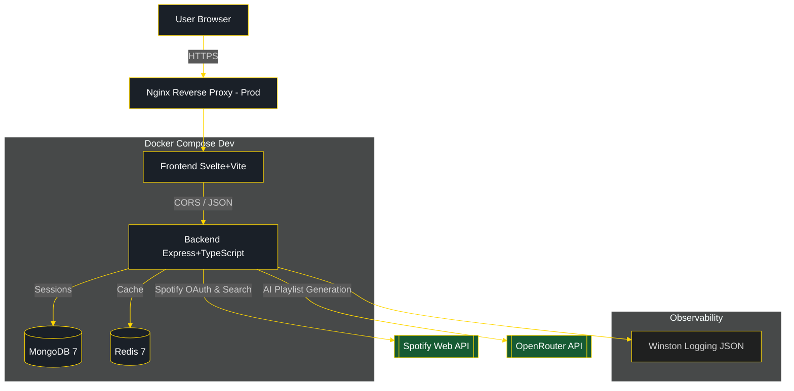
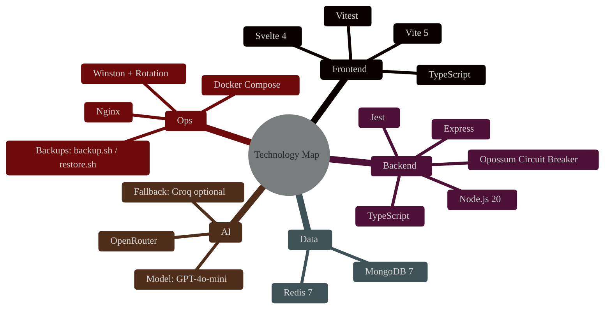
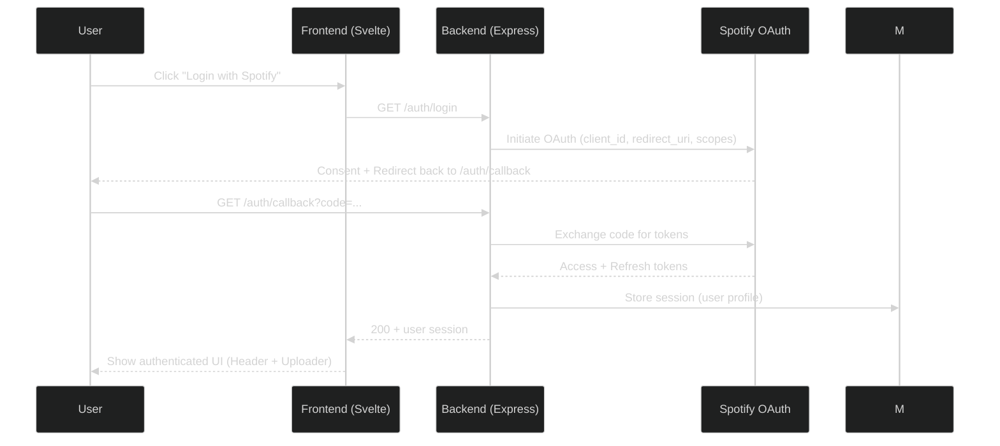
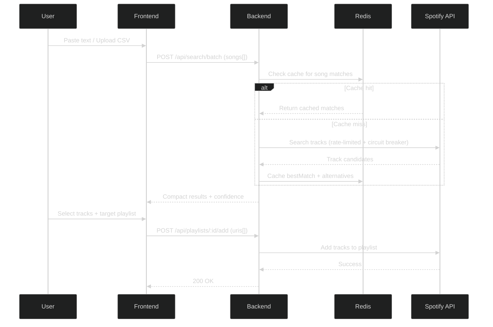
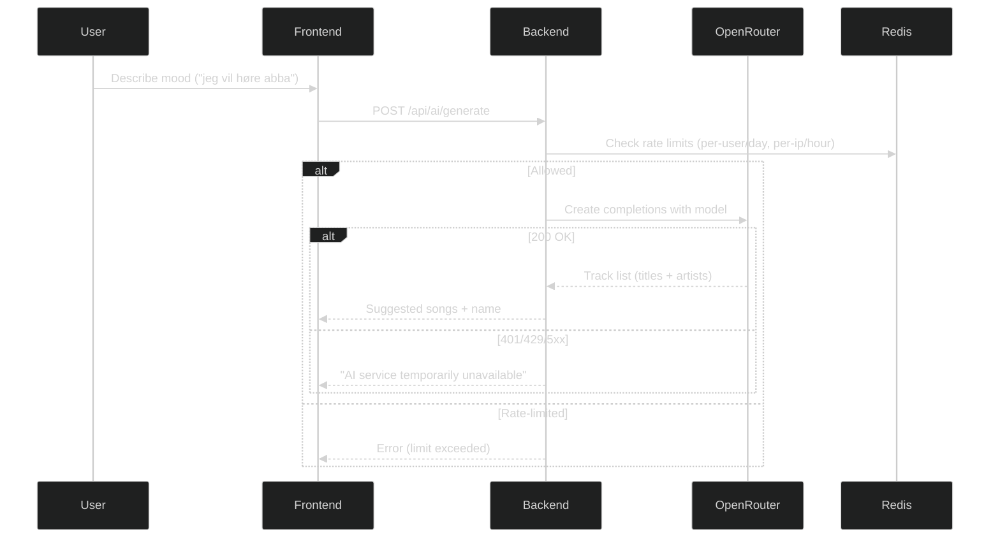
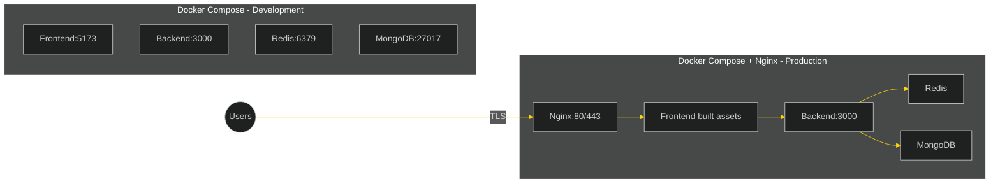
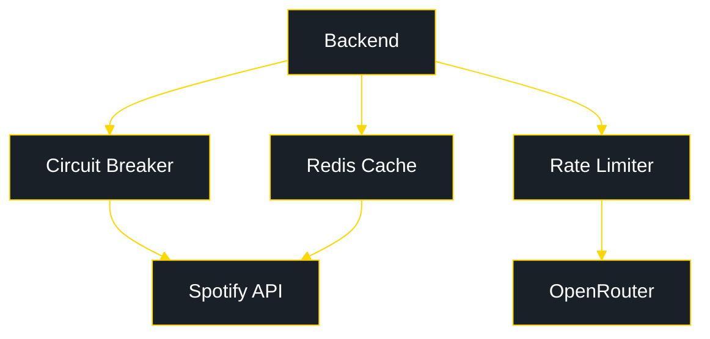
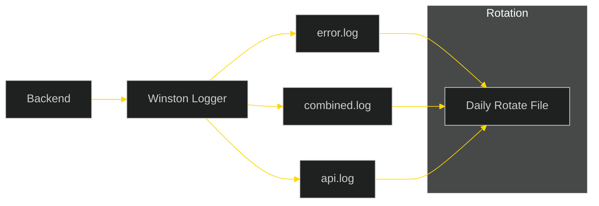
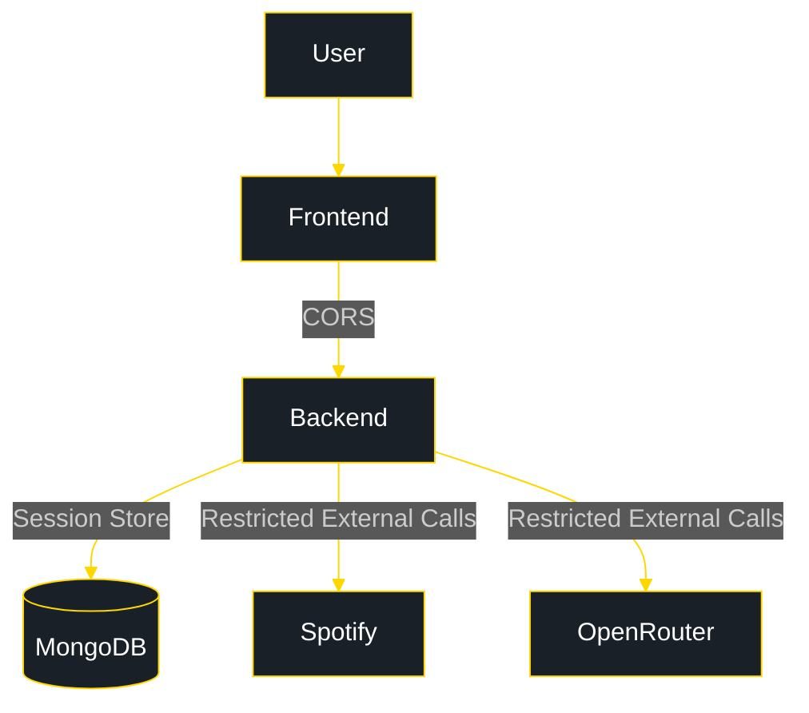
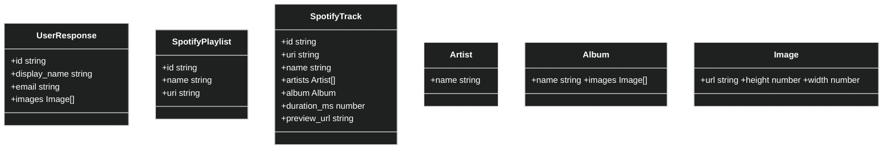

# Listify Architecture Overview

This document provides a high-level architecture overview of Listify — covering runtime components, data flows, deployment topology, observability, and security boundaries. All diagrams use a dark theme with high-contrast colors for readability.

## System Architecture (Runtime Topology)

---

## Technology Map

Key notes:
- Frontend talks to backend via Vite proxy in dev, Nginx in prod.
- Sessions stored in MongoDB; caching layered via Redis.
- AI provider via OpenRouter (with optional fallback providers if configured).

Technologies (bullet list):
- Svelte 4 — reactive, compile-time UI framework that compiles components to efficient JavaScript for fast, lightweight frontends.
- Vite 5 — lightning-fast dev server and build tool with HMR; optimized production builds and modern ES module tooling.
- TypeScript — static typing and rich IDE tooling that reduces runtime bugs and improves maintainability across frontend/backends.
- Vitest — fast, Vite-native test runner for frontend components and utilities; integrates well with Svelte.
- Node.js 20 — modern JavaScript runtime for the backend with improved performance, timers, and stable APIs.
- Express — minimal, flexible web framework used to implement REST APIs, middleware, and routing.
- Jest — backend unit/integration testing with mocks and snapshots to validate services and routes.
- Opossum Circuit Breaker — resilience library to prevent cascading failures when external services (Spotify/AI) degrade.
- MongoDB 7 — document database used for session storage and persistent user state.
- Redis 7 — in-memory cache and rate-limit store; reduces redundant Spotify calls by 60–80% and smooths throughput.
- OpenRouter — AI gateway that routes requests to compatible models/providers with unified API semantics.
- Model: GPT-4o-mini — cost-effective, fast model for playlist text generation; balances quality and latency for UX.
- Fallback: Groq (optional) — alternative AI provider to maintain availability when the primary provider fails.
- Docker Compose — orchestrates multi-service dev/prod environments (backend, frontend, Redis, MongoDB) with health checks.
- Nginx — reverse proxy for TLS, static assets, and routing to backend; production entry point.
- Winston with rotation — structured JSON logging with daily rotation; separate error/combined/api logs.
- Backups: backup.sh / restore.sh — automated backup and restore scripts for operational safety and disaster recovery.

---

## OAuth 2.0 Login Flow (Sequence)

---

## Playlist Upload Flow (Batch Search + Add)

Highlights:
- Redis significantly lowers repeated search cost.
- Circuit breaker prevents cascading Spotify API failures.

---

## AI Playlist Generation Flow (with Rate Limiting)

Notes:
- Set env `OPENROUTER_API_KEY` to a valid key to avoid 401 Unauthorized.
- Fallback provider can be enabled via `AI_FALLBACK_PROVIDER`.

---

## Deployment & Networking (Dev/Prod)

Health checks & ops:
- MongoDB health: `mongosh ... ping` in compose.
- Redis health: `redis-cli ping`.
- Automated backups via `backup.sh` and `restore.sh` folders under `backups/`.

---

## Caching & Resilience Components

- Circuit breaker protects against repeated external API failures.
- Rate limiter enforces `AI_RATE_LIMIT_PER_USER_DAILY` & `AI_RATE_LIMIT_PER_IP_HOURLY`.
- Redis keys: `profile:{userId}`, `playlists:user:{userId}:{limit}`.

---

## Observability (Logging)

- Structured JSON logs with contextual metadata (`service`, `userId`, `key`).
- Separate files: `error.log`, `combined.log`, `api.log` with rotation.

---

## Security Boundaries

- CORS: `FRONTEND_URL` and `CORS_ORIGIN` enforced in backend.
- Session management: `SESSION_SECRET`, secure cookies.
- Least privilege Spotify scopes.

---

## Types & Interfaces (Simplified)

---

## Environment & Configuration

Key environment variables (see `.env.example`):
- `SPOTIFY_CLIENT_ID`, `SPOTIFY_CLIENT_SECRET`, `SPOTIFY_REDIRECT_URI`
- `FRONTEND_URL`, `CORS_ORIGIN`
- `MONGO_URI`, `REDIS_URL`
- `AI_PROVIDER`, `OPENROUTER_API_KEY`, `OPENROUTER_MODEL`
- `AI_RATE_LIMIT_PER_USER_DAILY`, `AI_RATE_LIMIT_PER_IP_HOURLY`

---

## Backup & Restore

- `backup.sh` and `restore.sh` manage automated backups to `backups/` with timestamped directories.
- Retention configurable via env (see docs) and cron/planned scripts.

---

## Notes

- For local AI generation, ensure `OPENROUTER_API_KEY` is valid; otherwise UI will show "AI service temporarily unavailable".
- Docker dev uses `Dockerfile.dev` for hot-reload (`volumes: ./backend/src:/app/src`).
